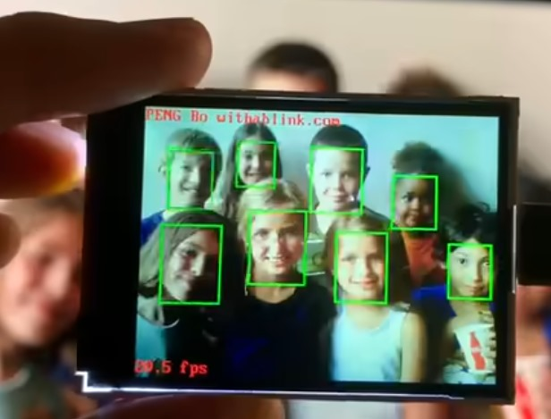
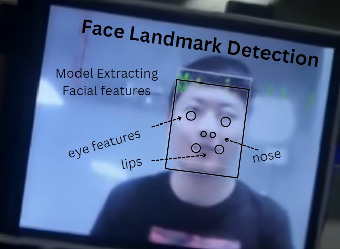
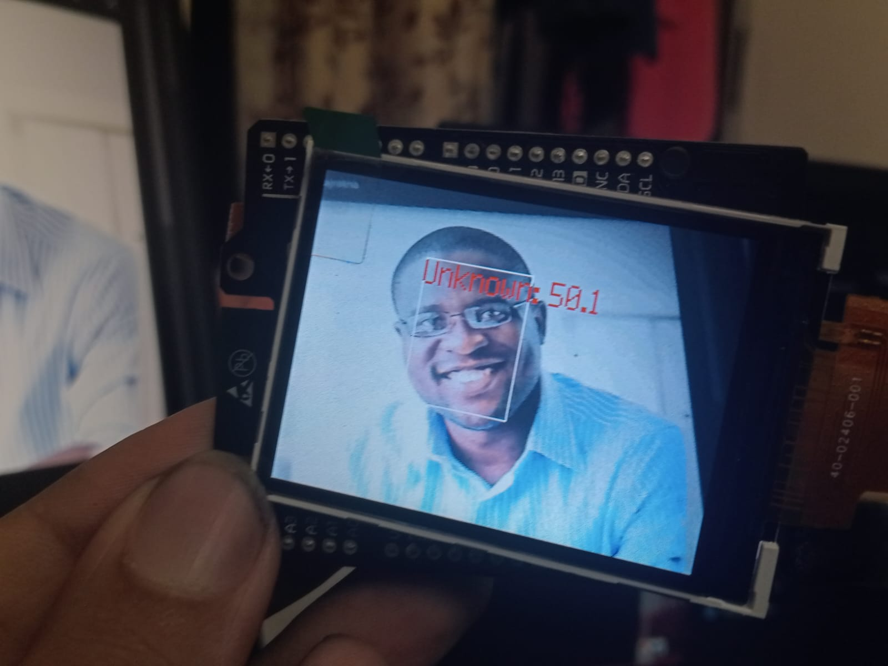
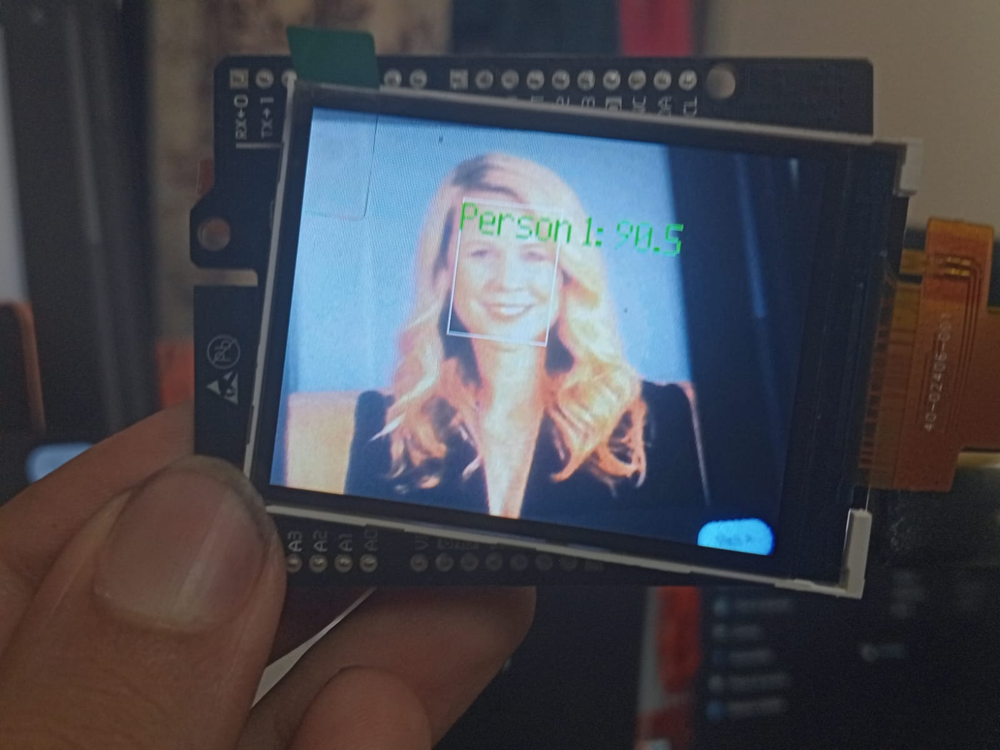
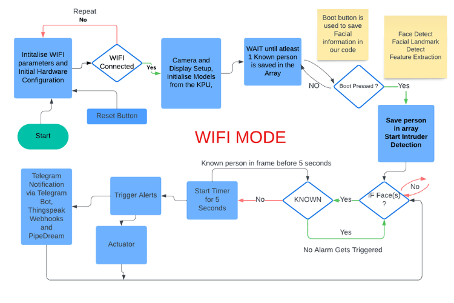

## camvisiotech-edge-ai-wifi
CamVisioTech is a standalone AI-powered face detection and recognition system built on the Maixduino hardware. This project is designed to operate independently without relying on external computing resources, making it efficient and accessible in low-resource environments. The project integrates both WiFi and GSM modules for network connectivity, allowing for real-time alerts and versatile deployment in environments with limited internet access. This particular repository contains the setup for the Wifi based approach to it.

## **Project Overview**

A smart surveillance system capable of:
- Detecting faces and objects in real time using the **NNCase** and **Yolo** based ML models.
- When an Intruder is detected, buzzer goes off and similarly any actuator can be controlled.
- Sending Telegram notifications to alert the user bu utilising Wifi capabalities. ( Other Third Party applications can also be integrated easily using applications like IFTTT, PipeDream etc. )
- No external computing is needed; all processing, from running ML model calculations to sending alerts, is handled on-board.
  
## **Demo Video**

For a live demonstration of the project in action, check out this video on Yourube

  

## **Hardware & Software Requirements**

### Hardware:
- **Maixduino** RISC V + AI Kit : An AI-focused development board with onboard image processing and machine learning. It also has an ESP32 chip for WI-FI and Bluetooth Capabilities.
- **Buzzer**: For triggering alerts.
- **Breadboard & Jumper Wires**: For wiring connections.
- **OV2640**: Camera Module
- **2.4 inch TFT Display**
- **Type C Data  Cable**

### Software:
- **Micropython**
- **MaixPy IDE**  (for build and run )
- **kflash_gui**  (for uploading firmware and models to the chip)
- **uPyLoader** (accessing, updating and deleting content of flash)

## System Architecture:

### **AI Model Training and Deployment**: 
  The Maixduino Kit, which includes an AI-capable microcontroller and camera, functions as the primary processing unit. It utilizes three core .smodel files trained via MaixHub.com—a model for Face(s) Detection, a model for Face Landmark Detection, and Feature Extraction. These models process and identify known faces, storing features as recognized persons (e.g., "Person 1," "Person 2") in arrays for rapid matching. The setup allows for the simultaneous recognition of multiple faces, enabling quick identification of individuals stored in the system.
  - **Face Detection**:
    
      **Purpose**: Detects faces in the camera feed, identifying multiple faces at once.
      
      **Model Type**: YOLOv2 object detection model, optimized for real-time processing on the Maixduino’s hardware.
      
      **Outcome**: Locates face bounding boxes to trigger further analysis.
    

     

  - **Face Landmark Detection**: 
  
      **Purpose**: Identifies specific facial landmarks (e.g., eyes, nose, mouth) within detected faces.
      
      **Model Type**: Keypoint detection model, enabling finer facial structure identification.
      
      **Outcome**: Provides a precise facial map, aiding in consistent feature extraction for recognition.

     

    
  - **Feature Extraction**: 
  
      **Purpose**: Extracts unique facial features from detected landmarks to distinguish individual identities.
      
      **Model Type**: Embedding model that outputs feature vectors for each detected face.
      
      **Outcome**: Compares these vectors with stored profiles, recognizing known individuals and categorizing unknown ones as intruders.

  
  
  

    
### **Intruder Detection and Actuator Control**: 
  When an unrecognized person (not in the known faces array) is detected, the system categorizes them as an intruder. It triggers an immediate response, such as sounding a buzzer or activating an LED indicator. The system is also capable of relay control which also allows integration with other actuators, such as door locks, providing instant, real-time physical security.

### **Communication and Alerts**: 
  For reliable notifications, the system can use either Wi-Fi or GSM connectivity to send alerts, ensuring communication in areas with variable internet access. Integrating with third-party messaging apps, like Telegram. This multifaceted communication ensures that users are informed wherever they are, making the system suitable for both urban and remote applications.

## Flowchart:

     

### Why Thingspeak as Mediator:
ThingSpeak offers seamless integration for handling HTTP and MQTT protocols, making it an ideal choice for cloud data management. Devices can utilize HTTP POST and GET requests over Wi-Fi to send data directly to the cloud in real-time. In areas without Wi-Fi coverage, GSM-based devices can efficiently transmit data to ThingSpeak using MQTT, a lightweight messaging protocol optimized for 4G networks.
Additionally, ThingSpeak’s built-in support for webhooks significantly enhances its versatility. Webhooks enable integration with platforms like IFTTT (If This Then That) and PipeDream (a free alternative I have used). This allows real-time data from ThingSpeak to trigger automated actions on other platforms. For instance, third-party tools like Telegram can be integrated via webhook triggers, enabling users to receive instant alerts or notifications effortlessly.
  
## Setup
soon
